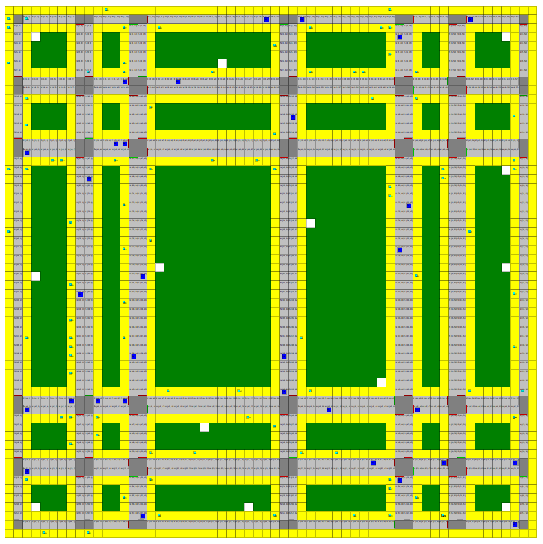

# Informe

## Tema

"Semáforos inteligentes: Una alternativa para mejorar el tráfico en una ciudad"

## Integrantes

- Álvaro Luis González Brito C-312
- David Becerra Lezcano C-312
- Javier Lima García C-312

## Introducción

Son numerosos los problemas derivados de un tráfico no controlado: contaminación (atmosférica, sonora), congestiones (que generan malestar en la población) e incluso retrasos en la economía. De ahí que resulte fundamental para un país el minimizar estas variables negativas. Sin embargo, el tráfico en una ciudad resulta un sistema muy complejo, un problema que va unido al aumento de autos y peatones en infraestructuras que apenas varían (carreteras, puentes, aceras, etc). 

Dadas estas problemáticas son necesarios modelos fiables de la realidad, capaces abstraer las variables fundamentales para permitirnos encontrar puntos claves y realizar cambios que impacten positivamente con el mínimo costo.

Gracias a los avances computacionales/tecnológicos de la actualidad ya es posible la construcción de estos modelos, donde la simulación constituye la pieza clave. Basadas en agentes inteligentes estas simulaciones han abierto la puerta a estudios que están revolucionando el diseño y manejo del tráfico con el mínimo gasto de recursos.

### Problema fundamental

En este proyecto pretendemos dar respuesta a la siguiente interrogante:

**¿Es posible mejorar el tráfico de una ciudad mediante el uso de semáforos inteligentes?**

(Donde "semáforos inteligentes" se entiende por aquellos semáforos capaces de ajustar su comportamiento de acuerdo a múltiples de variables del entorno con el fin de minimizar el tiempo de espera de tanto automóviles, como de peatones)

Para ello, utilizamos una simulación, basada en **Eventos Discretos** que contiene múltiples agentes inteligentes guiados por un modelo **BDI** (Belief, Desire, Intention).

### Modelación

Para llevar a cabo la simulación y abstraer las variables necesarias para nuestra investigación, decidimos modelar el problema de la siguiente forma:

#### Mapa

El mapa de una ciudad está representado por una matriz que contiene como estructuras principales:

- carreteras
- aceras
- intersecciones
- lugares de interés

Las carreteras y aceras constituyen los medios a través de los cuales se desplazan automóviles y peatones respectivamente. Con el fin de relajar la modelación decidimos que las carreteras tuvieran solo cuatro direcciones (norte, sur, este y oeste) y estuvieran rodeadas por aceras.

La unión de dos carreteras constituye una intersección, y son estas las estructuras en las que están presentes lo semáforos. De nuevo, con el fin de abstraernos de detalles, decidimos que todas las intersecciones presentaran un semáforo.

Por último, los lugares de interés representan sitios que potencialmente pueden ser visitados por múltiples peatones y automóviles. Estos lugares de interés, poseen una descripción (en lenguaje natural) que afecta sin influencia en el entorno de la simulación como veremos más adelante.

#### Semáforos

#### Automóviles

#### Peatones

#### Eventos