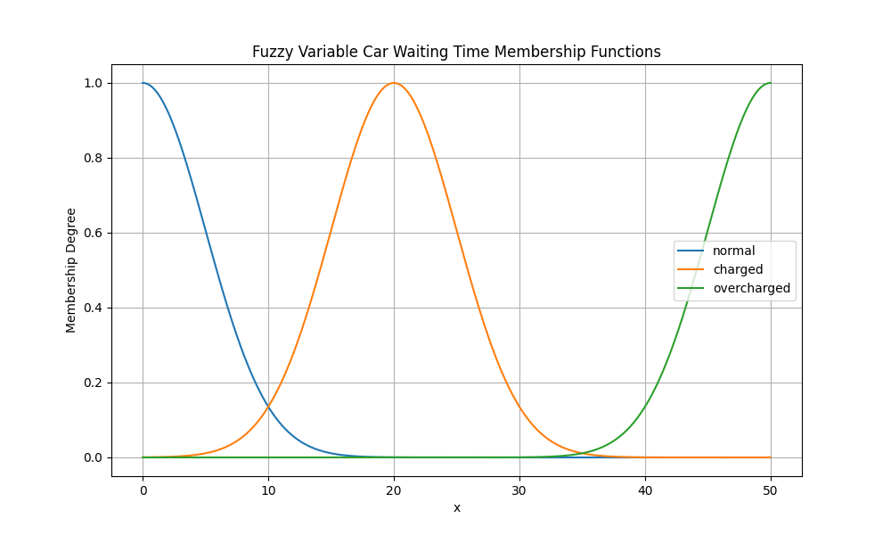

# Informe

## Tema

"Semáforos inteligentes: Una alternativa para mejorar el tráfico en una ciudad"

## Integrantes

- Álvaro Luis González Brito C-312
- David Becerra Lezcano C-312
- Javier Lima García C-312

## 1. Introducción

Son numerosos los problemas derivados de un tráfico no controlado: contaminación (atmosférica, sonora), congestiones (que generan malestar en la población) e incluso retrasos en la economía. De ahí que resulte fundamental para un país el minimizar estas variables negativas. Sin embargo, el tráfico en una ciudad resulta un sistema muy complejo, un problema que va unido al aumento de autos y peatones en infraestructuras que apenas varían (carreteras, puentes, aceras, etc). 

Dadas estas problemáticas son necesarios modelos fiables de la realidad, capaces abstraer las variables fundamentales para permitirnos encontrar puntos claves y realizar cambios que impacten positivamente con el mínimo costo.

Gracias a los avances computacionales/tecnológicos de la actualidad ya es posible la construcción de estos modelos, donde la simulación constituye la pieza clave. Basadas en agentes inteligentes estas simulaciones han abierto la puerta a estudios que están revolucionando el diseño y manejo del tráfico con el mínimo gasto de recursos.

### 1.1 Problema fundamental

En este proyecto pretendemos dar respuesta a la siguiente interrogante:

**¿Es posible mejorar el tráfico de una ciudad mediante el uso de semáforos inteligentes?**

(Donde "semáforos inteligentes" se entiende por aquellos semáforos capaces de ajustar su comportamiento de acuerdo a múltiples de variables del entorno con el fin de minimizar el tiempo de espera de tanto automóviles, como de peatones)

Para ello, utilizamos una simulación, basada en **Eventos Discretos** que contiene múltiples agentes inteligentes guiados por un modelo **BDI** (Belief, Desire, Intention).

### 1.2 Modelación

Para llevar a cabo la simulación y abstraer las variables necesarias para nuestra investigación, decidimos modelar el problema de la siguiente forma:

#### Mapa


El mapa de una ciudad está representado por una matriz que contiene como estructuras principales:

- carreteras (casillas gris claro en la image)
- aceras (casillas amarillas en la imagen)
- intersecciones (casillas gris oscuro en la imagen)
- lugares de interés (casillas blancas en la imagen)

Las carreteras y aceras constituyen los medios a través de los cuales se desplazan automóviles y peatones respectivamente. Con el fin de relajar la modelación decidimos que las carreteras tuvieran solo cuatro direcciones (norte, sur, este y oeste) y estuvieran rodeadas por aceras.

La unión de dos carreteras constituye una intersección, y son estas las estructuras en las que están presentes los semáforos. De nuevo, con el fin de abstraernos de detalles, decidimos que todas las intersecciones presentaran un semáforo.

Por último, los lugares de interés representan sitios que potencialmente pueden ser visitados por múltiples peatones y automóviles. Estos lugares de interés, poseen una descripción (en lenguaje natural) que afecta su influencia en el entorno de la simulación como veremos más adelante.

#### Semáforos

Los semáforos controlan el tráfico en las intersecciones. Apuntando al fin del proyecto, diseñamos dos tipos de semáforos: semáforos inteligentes y semáforos estándar.

Los semáforos inteligentes regulan su comportamiento a partir de las variables del entorno (clima, horario, etc) utilizando como motor la lógica difusa (como veremos más adelante). Los semáforos estándar, por su parte, poseen un tiempo predefinido en su ciclo que no varía durante la simulación.
Decidimos también, con el fin de simplificar, que los semáforos solo tuvieran como luces: rojo y verde.

#### Automóviles y peatones (casillas azul y cyan respectivamente en la imagen)

Los automóviles, junto a los peatones, se desplazan por el mapa, siguiendo la ruta más eficiente teniendo en cuenta la distancia y considerando la carga de los semáforos. Estos en conjunto con los semáforos, representan los agentes inteligentes de la simulación.

## 2. Implementación

### 2.1 Simulación de Eventos Discretos

#### 2.1.1 Marco teórico

La **Simulación de Eventos Discretos (SED)** es una técnica usada para modelar sistemas en los que los cambios en el estado ocurren en puntos específicos en el tiempo. El modelo simula eventos que alteran el estado del sistema en momentos discretos, como la llegada de una tarea a una cola o la finalización de un proceso.

**Elementos clave en la Simulación de Eventos Discretos:**

1. **Sistema:** 
   Es el proceso o conjunto de procesos que se quiere simular. Ejemplos incluyen sistemas de colas, producción industrial, redes de comunicación, etc.

2. **Evento:**
   Un **evento** es una ocurrencia que provoca un cambio en el estado del sistema. Los eventos se programan en tiempos específicos y pueden incluir llegadas, salidas, fallos de máquinas, etc.

3. **Reloj de Simulación:**
   Es una variable que mantiene la cuenta del tiempo dentro de la simulación. En SED, el tiempo avanza en saltos de evento a evento (no continuamente).

4. **Lista de eventos futuros (Future Event List - FEL):**
   Es una lista ordenada cronológicamente de los eventos que ocurrirán en el futuro. A medida que ocurre un evento, se extrae el primer evento de la lista, se procesa y se actualiza el estado del sistema.

5. **Estado del Sistema:**
   Define las variables que describen el sistema en cualquier punto dado. Ejemplo: el número de clientes en cola, el estado de las máquinas (ocupado o libre).

6. **Estadísticas:**
   Durante la simulación, se recopilan datos sobre el sistema. Estos datos permiten realizar análisis para obtener métricas como el tiempo medio en el sistema o el porcentaje de utilización de recursos.

7. **Reloj de Simulación:**
   Es una variable que mantiene la cuenta del tiempo dentro de la simulación. En SED, el tiempo avanza en saltos de evento a evento (no continuamente).

8. **Políticas de decisión:**
   Son las reglas o estrategias que determinan cómo se manejan ciertas decisiones durante la simulación. Por ejemplo, ¿qué cliente debe ser atendido primero en una cola? Las políticas comunes incluyen FIFO (primero en entrar, primero en salir), LIFO (último en entrar, primero en salir) y prioridades.

**Proceso básico de una SED**

1. **Inicialización:**
   Se inicializa el reloj de simulación, el estado del sistema y la lista de eventos futuros.

2. **Ejecutar eventos:**
   Se toma el siguiente evento de la lista de eventos futuros y se avanza el reloj de simulación al tiempo de ese evento. Se ejecuta la lógica del evento y se actualiza el estado del sistema.

3. **Actualizar la lista de eventos futuros:**
   Tras la ejecución de un evento, pueden surgir nuevos eventos. Estos se agregan a la lista de eventos futuros en el tiempo correcto.

4. **Condición de parada:**
   La simulación puede detenerse después de un tiempo definido o cuando no quedan más eventos por ejecutar.

#### 2.1.2 Detalles de Implementación

La simulación llevada a cabo en el proyecto está basada en Eventos Discretos. En esta el *Sistema* está constituido por variables como:
 
- la posición de automóviles y peatones, 
- las condiciones climáticas, 
- el estado de los semáforos, 
- los lugares de interés

Por su parte los Eventos comprenden la llegada de un nuevo automóvil/peatón y la ocurrencia de una precipitación; mientras que la Lista de Futuros Eventos es una cola de prioridad ajustada con respecto a la inminencia de los eventos que contiene.

Durante el tiempo transcurrido entre eventos, los automóviles, peatones y semáforos actúan, logrando fluidez y fidelidad a su comportamiento en un entorno real.

La condición de parada utilizada fue una duración específica.

```pseudo-code
while True:
   while evento_más_inminente.fecha == fecha
      procesar_evento_más_inminente()

   actualizar_agentes()

   incrementar(fecha)

   if fecha == fecha_final
      break
```

### 2.2 Fuzzy Logic 

Fuzzy Logic es una forma en la que se representa de forma continúa la verdad, siendo $0$ totalmente falso, $1$ totalmente verdadero, de forma que existe un grado de verdad que sería un número en $[0, 1]$. Un sistema de inferencia usando lógica difusa, posee :

#### Variables Fuzzy

Una variable Fuzzy posee un dominio que puede ser por ejemplo los números reales entre $[0, 1]$, asociado a una variable fuzzy hay conjuntos de los cuales esta variable posee un grado de pertenencia ( un número entre $[0, 1]$), de ahí que sea es necesario tener para cada variable, para cada conjunto, una función cuyo dominio es el dominio de la variable y cuya salida es un número entre $[0, 1]$ indicando el grado de pertenencia de esta variable a el conjunto. Un sistema está compuesto por variables Fuzzy de entrada y variables Fuzzy de salida. Su entrada es valores de estas variables fuzzy en su dominio y su salida serían valores de las variables fuzzy de salida en su dominio. Por tanto su objetivo es dado el valor de las variables de entrada estimar el valor de las variables fuzzy de salida.


#### Reglas

Las operaciones lógicas pueden ser representadas de varias formas, usamos:

$NOT(x) = 1 - x$

$OR(x,y) = max(x, y)$

$AND(x, y) = min(x, y)$

Las reglas permiten hallar los grados de pertenencia de las variables de salida en función de las variables de entrada. Por ejemplo si la comida fue buena y el servicio rápido entonces la propina es alta, se interpreta como :

el grado de pertenencia de la variable de salida "propina" en el conjunto "alta" es el resultado de el *and* entre los grados de pertenencia de buena respecto a calidad de la comida y de rápido respecto a tiempo del servicio.

#### Proceso de inferencia

Con lo explicado anteriormente el proceso sería, primero se usa los valores de dominio de las variables de entrada para hallar su grado de pertenencia en cada una de sus clasificaciones, con estos grados de pertenencia se deducen los grados de pertenencia de las variables de salida usando reglas, quedaría la siguiente pregunta: ¿Dados los grados de pertenencia de una variable en sus clasificaciones cómo encontrar un valor en su dominio cuya evaluación de estos grados? ( es como hallar el inverso de una función).

Hay varias formas de responder esa pregunta, usamos el método del centroide que consiste en :
    - tomar de cada función de grado de pertenencia la proporción correspondiente a este grado de pertenencia : Esto significa que si el grado de pertenencia es $0.5$, solamente considerar los valores de la función que están por debajo de $0.5$, como si se le hallara el área a la función $g(x) = min(f(x), 0.5)$.
    - juntar todas las áreas y hallar el centroide esta nueva área. Notar que las áreas pueden sobreponerse.
    - la coordenada de este centroide lo devolveremos como valor de el dominio de la variable. 


### 2.3 BDI y Agentes Inteligentes

Los agentes inteligentes deben tener en cuenta los siguientes tres características :

*Reactividad* : Los agentes inteligentes son capaces de captar el contexto en el que se encuentran y responder rápidamente a los cambios que ocurren en este satisfaciendo las condiciones de el agente y del entorno o contexto.

*Pro-actividad* : Deben ser capaces de planear estrategias para satisfacer sus objetivos y restringirse a estas.

*Habilidad Social* : Los agentes inteligentes deben ser capaces de interactuar con otros agentes para satisfacer sus objetivos.

Surge el problema de hallar un balance entre la reactividad y la pro-actividad. 
Una analogía a esto ocurre en con la arquitectura BDI.

En la arquitectura BDI los agentes poseen creencias sobre su entorno que pueden ser correctas o no, poseen objetivos que desean lograr e intenciones que conllevarán a acciones o planes para lograr sus objetivos. 

Constantemente estará siguiendo el siguiente bucle para determinar su comportamiento:

Primero percibe el entorno actual, lo que actualiza sus creencias, en base a esto y sus deseos anteriores actualize sus deseos y sus intenciones, traza un plan y comienza a ejecutar este paso a paso. Pero en cada paso puede suceder:

- que ya no sea factible continuar este plan ( debido a cambios en el entorno) por lo que debe *reaccionar* cambiando sus intenciones y por tanto un plan nuevo.

- puede finalizar su plan procediendo a escoger uno nuevo. 

- también puede reconsiderar si continuar ejecutando el plan ( que tanto reconsidera es lo que influye en el balance entre la reactividad y la pro-actividad) 

- finalmente es posible que a consecuencia de la actualización de sus deseos no tenga sentido continuar con el plan por lo que parará y buscará uno nuevo (reactividad).


#### Semáforos

Los semáforos poseen un sistema de lógica difusa en su comportamiento, alternan entre *ROJO*, permitiendo el paso de los peatones, y *VERDE* permitiendo el paso de los carros, que tanto tiempo debe permanecer un semáforo en *VERDE* y que tan cargado se encuentra son las preguntas que debe responder el sistema de lógica difusa. Con el objetivo de que si el factor peatonal es alto estaría menos tiempo en *VERDE* y viceversa. Aunque influyen más factores.

Las variables de entrada serían:
    - El clima, con conjuntos *lloviendo*, *nubloso*, *soleado*
    - El tiempo de espera de los carros (una vez se plantea cruzar un semáforo)
    - El tiempo de espera de los peatones (una vez se plantea cruzar un semáforo)
    - El mes del año.

Las variables de salida serían:
    - La sobre-carga del semáforo, usada por los carros.
    - El tiempo que ha de permanecer en verde.




Para cada variable de salida, para conjunto que de esta es necesario añadir una regla para determinar su valor : 

Algunas reglas que añadimos son:
    - el *GREEN_TIME* es alto si el mes es de alta o el tiempo de espera de los carros es alto o el tiempo de espera de los peatones es normal o el clima no es soleado o es de madrugada.
    - el *GREEN_TIME* es bajo si se cumple que el tiempo de espera de los carros es bajo y el tiempo de espera de los peatones es bajo y el tiempo no es lluvioso y además es de noche
    - el *OVERLOAD* es alto si el tiempo de espera de los peatones y los carros es alto.

##### Comportamiento

Siempre actualiza los valores de las variables de entrada.

Los tiempos de espera de los carros y los peatones son dados por estos cuando pasan el semáforo en cuestión.

Con alguna probabilidad (para evitar que esté constantemente ejecutando el proceso de inferencia) actualiza sus variables de salida ( ejecuta el proceso de inferencia).

Cada vez que cambia el *GREEN_TIME*, a consecuencia de cambios en las variables de entrada, espera a estar en estado *ROJO* y cambia el tiempo a verde.

Provee de un método público a los demás agentes para que estos sepan cuanto tiempo le queda a el semáforo en el estado en que se encuentra.

#### Automóviles

El carro se encuentra desplazándose por las carreteras sin poder haber dos carros en una misma posición, y respetando los semáforos, comienzan en una posición inicial y su objetivo es un lugar de interés localizado en el mapa, una vez lleguen a este lugar son eliminados de la simulación. 

El carro necesita una forma de encontrar un camino hacia su lugar de destino, ha de saber actuar cuando no puede seguir con su plan y desea evitar estancarse en un semáforo.

El carro posee una estrategia que seguirá para llegar a su destino ( carácter pro-activo) pero ya sea, porque no le es posible continuar o porque no le dio resultado la actualizará ( reconsiderar su estrategia), además de que debe moverse siempre si le es posible (carácter reactivo), o sea, porque no pueda seguir su plan no debe dejar de moverse porque si no obstruiría el tráfico.

Posee un método *emergency_act* que como el nombre indica, lo utiliza cuando su plan no es viable, por las condiciones del ambiente. 

En circunstancias normales empleará su estrategia para decidir que camino tomar.

##### Estrategia:

El carro puede estar en dos estados : *Obstruido* y *Libre*, puede tomar cuatro acciones : *Random*, *Depth-DFS*, *Dijkstra*, *Dijkstra-Modified*, esto es representado a través de una matriz de probabilidades de $2*4$, en cada fila, está las probabilidades de que tome la acción de esa columna, las probabilidades de una fila han de sumar $1$. La idea es que a medida que el carro usa las acciones actualize estas probabilidades en función de si le fue útil o no utilizar esta acción.

El carro se encuentra en el estado *Obstruido* si sus últimas tres posiciones son las mismas.
El carro se encuentra en el estado *Libre* si sus últimas tres posiciones son diferentes.

En un estado, decide que acción tomar, escogiendo un número aleatorio entre $[0, 1]$ y en dependencia de que intervalo se encuentre escoge la acción.

Una acción en un estado es priorizada ( aumenta su probabilidad ) si permitió que el carro se moviera en las últimas dos iteraciones, en caso contrario su probabilidad  en ese estado es disminuida. Esto es una forma de implementar el método *reward*, puede ser escogida otra forma de *reward* una acción.

Cada una de las acciones mencionadas anteriormente consiste en:

##### Random:
Escoge una posición adyacente (pudiendo tener que cruzar un semáforo para moverse)
##### Dijkstra:
Halla el camino más corto de la posición actual a el destino ( notar que el grafo es dirigido), siendo todos los pesos $1$.


Las siguientes dos estrategias son basadas en una heurística, dado el dinamismo de el ambiente donde se encuentra el carro.

El carro desea llegar lo más rápido posible a su lugar de destino, debido a la presencia de semáforos el camino más corto no tiene porque ser el óptimo. Una idea inicial es darle un peso diferente a los semáforos dependiendo de que tan cargados estén, sería análogamente un Dijkstra en un grafo donde las aristas entre carreteras poseen peso $1$, y las que son entre carretera y semáforo poseen un peso dependiendo de el semáforo en cuestión. Para obtener el peso del semáforo añadimos una variable *OVERLOAD* de salida a el *FuzzySystem* del semáforo.

La idea anterior no es suficiente porque el entorno es dinámico, la carga de un semáforo varía, por ejemplo, si el carro traza una ruta en la que debe cruzar tres semáforos siendo el tercero el menos cargado, es posible que en el tiempo en que cruza los dos primeros semáforos el tercer semáforo se sobrecargue y no resulte efectiva la ruta.

Para evitar lo anterior :

##### DijkstraM:

En este mantenemos la idea de darle un peso a los semáforos determinado por su *OVERLOAD*, pero este peso lo dividimos entre la distancia de el semáforo a la posición actual de el carro. De esta forma los semáforos muy alejados no aportarían mucho a el peso del camino, mientras que los cercanos sí.

##### Depth-DFS:

Usamos un *DFS* de profundidad limitada, la idea es la siguiente, obtenemos un peso o distancia de que tan bueno es un camino de tamaño $k$ en términos de la sobre-carga de los semáforos, y después desde la posición en que acaba el camino hallamos la distancia de esta posición a el destino ($Dijkstra$), sumamos estos dos números y tenemos un peso a un camino, entre todos los pesos escogemos el menor. Notar que $k$ ha de ser pequeña, porque se consideran todos los caminos de tamaño $k$ que comienzan en la posición actual. Tiene como objetivo dividir el peso de un camino en dos partes : la cercanía al carro influenciado por los semáforos y la distancia a el objetivo.

Es posible añadir más acciones y más estados en los que se puede encontrar el carro, y análogamente otras heurísticas respecto a que con cuales condiciones priorizar o no una acción en un estado. Los carros no poseen factor social incorporado, solamente pro-activo y reactivo. Los carros no pueden constantemente re-plantearse su estrategia porque sería costoso por lo que deben tener un balance de que tanto se mantienen con su plan o lo reconsideran.

#### Peatones

Los agentes caminantes están basados en la arquitectura $BDI$, estos se mueven a través de las aceras y pueden cruzar una calle siempre que el semáforo esté en rojo, ellos poseen varios lugares de interés a los que desean ir, (tienen una prioridad sobre cuales desean visitar primero), pero no saben inicialmente donde se encuentran estos, poseen una creencia de donde puedan estar. A medida que se mueven y visitan lugares de interés en el mapa guardan actualizan sus creencias sobre los lugares de interés en el mapa. A su vez actualizan las prioridades sobre los lugares que desean visitar, escogiendo para visitar ( intención) el de mayor prioridad, incorporan un factor social además.

Paso a paso su funcionamiento:

1 - Actualizan sus creencias: Si en su posición actual hay un lugar de interés añaden esta información a sus creencias (sabe donde está, por tanto es conocimiento). Si en su posición hay otro caminante se escoge un número aleatorio y si es menor que su factor social, este caminante actualiza sus creencias además usando los creencias del caminante con el que se encontró. O sea cada caminante tiene un factor social como un número entre $[0, 1]$, para decidir cuando ser social con otros caminantes. Además un caminante posee otro factor de confianza, si esta es baja es menos probable que escoja creencias de otro caminante que no sean certeras. Siempre escoge las que representen conocimiento. De esta forma un caminante actualiza sus creencias.

2 - Si ya visitó todos los lugares que deseaba entonces es removido de la simulación.

3 - Cada caminante posee un factor de reactivad, entonces si su plan se acabó ( el camino que estaba siguiendo ya lo culminó) o un número aleatorio entre $[0,1]$ es menor que este factor, el caminante actualiza sus deseos y ha de escoger un plan nuevo.

Actualiza sus deseos de la siguiente forma: Sus deseos son representados a través de un diccionario donde a cada lugar que desea visitar le es asignado una prioridad. Si hay un caminante en mi posición que también desea ir a un lugar en específico le es aumentada la prioridad, aquí nuevamente se tiene en cuenta el factor social. Si hay algún lugar entre mis deseos que se donde se encuentra le aumento la prioridad. Aleatoriamente escojo un lugar y le aumento la prioridad. Finalmente si un caminante lleva mucho tiempo en una posición en específico se igualan todas las prioridades.

Escoge un plan de la siguiente forma: Escoge como lugar o intención a ir el de más prioridad entre sus deseos, si el caminante está seguro de donde está el lugar y posee suficiente deseo de visitarlo usará Dijkstra para determinar el camino. En caso contrario con cierta probabilidad se moverá aleatoriamente o usará Dijkstra para moverse hacia la posición del lugar ( pudiendo en este caso no ser la correcta). En el caso de los caminantes a diferencia de los carros la única forma de que no se pueda mover es que estén esperando por un semáforo.

4 - Finalmente escoge la siguiente posición en el camino determinado por su plan para moverse, si no le es posible moverse se mantiene en la posición actual.

Nota : Todas las constantes que son probabilidades entre $[0,1]$ es una idea de métodos de optimización como Particle Swarm Optimization.

## 3. Referencias

An Introduction to Multi Agent Systems, Michael Wooldridge

Temas de Simulación, Luciano García Garrido

Fuzzy Sets and Fuzzy Logic Theory and Applications, GEORGE J.KLIR AND BO YUAN