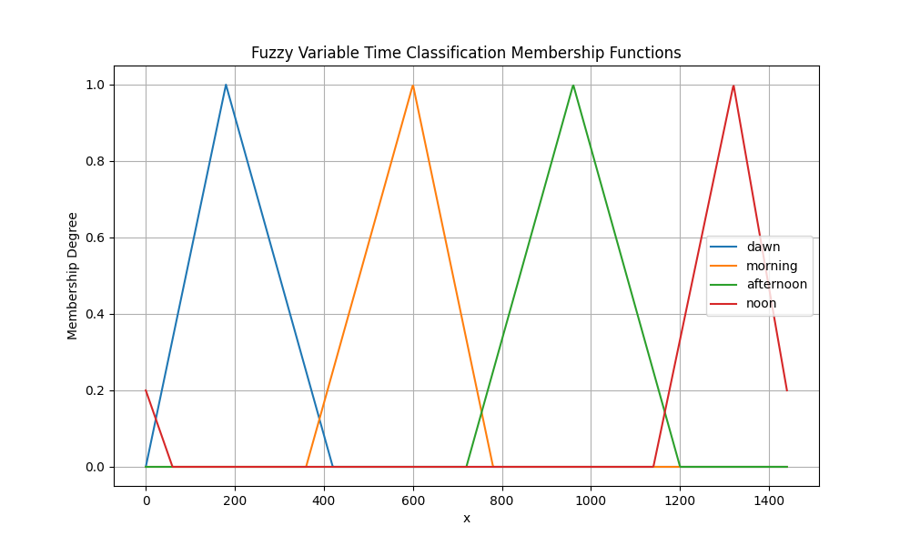

## Fuzzy Logic 

Fuzzy Logic es una forma en la que se representa de forma continúa la verdad, siendo $0$ totalmente falso, $1$ totalmente verdadero, de forma que existe un grado de verdad que sería un número en $[0, 1]$. Un sistema de inferencia usando lógica difusa, posee :

### Variables Fuzzy

Una variable Fuzzy posee un dominio que puede ser por ejemplo los números reales entre $[0, 1]$, asociado a una variable fuzzy hay conjuntos de los cuales esta variable posee un grado de pertenencia ( un número entre $[0, 1]$), de ahí que sea es necesario tener para cada variable, para cada conjunto, una función cuyo dominio es el dominio de la variable y cuya salida es un número entre $[0, 1]$ indicando el grado de pertenencia de esta variable a el conjunto. Un sistema está compuesto por variables Fuzzy de entrada y variables Fuzzy de salida. Su entrada es valores de estas variables fuzzy en su dominio y su salida serían valores de las variables fuzzy de salida en su dominio. Por tanto su objetivo es dado el valor de las variables de entrada estimar el valor de las variables fuzzy de salida.

### Reglas

Las operaciones lógicas pueden ser representadas de varias formas, usamos:
    - $NOT(x) = 1 - x$
    - $OR(x,y) = max(x, y)$
    - $AND(x, y) = min(x, y)$

Las reglas permiten hallar los grados de pertenencia de las variables de salida en función de las variables de entrada. Por ejemplo si la comida fue buena y el servicio rápido entonces la propina es alta, se interpreta como :

el grado de pertenencia de la variable de salida "propina" en el conjunto "alta" es el resultado de el *and* entre los grados de pertenencia de buena respecto a calidad de la comida y de rápido respecto a tiempo del servicio.

### Proceso de inferencia

Con lo explicado anteriormente el proceso sería, primero se usa los valores de dominio de las variables de entrada para hallar su grado de pertenencia en cada una de sus clasificaciones, con estos grados de pertenencia se deducen los grados de pertenencia de las variables de salida usando reglas, quedaría la siguiente pregunta: ¿Dados los grados de pertenencia de una variable en sus clasificaciones cómo encontrar un valor en su dominio cuya evaluación de estos grados? ( es como hallar el inverso de una función).

Hay varias formas de responder esa pregunta, usamos el método del centroide que consiste en :
    - tomar de cada función de grado de pertenencia la proporción correspondiente a este grado de pertenencia : Esto significa que si el grado de pertenencia es $0.5$, solamente considerar los valores de la función que están por debajo de $0.5$, como si se le hallara el área a la función $g(x) = min(f(x), 0.5)$.
    - juntar todas las áreas y hallar el centroide esta nueva área. Notar que las áreas pueden sobreponerse.
    - la coordenada de este centroide lo devolveremos como valor de el dominio de la variable. 

### Referencias:

