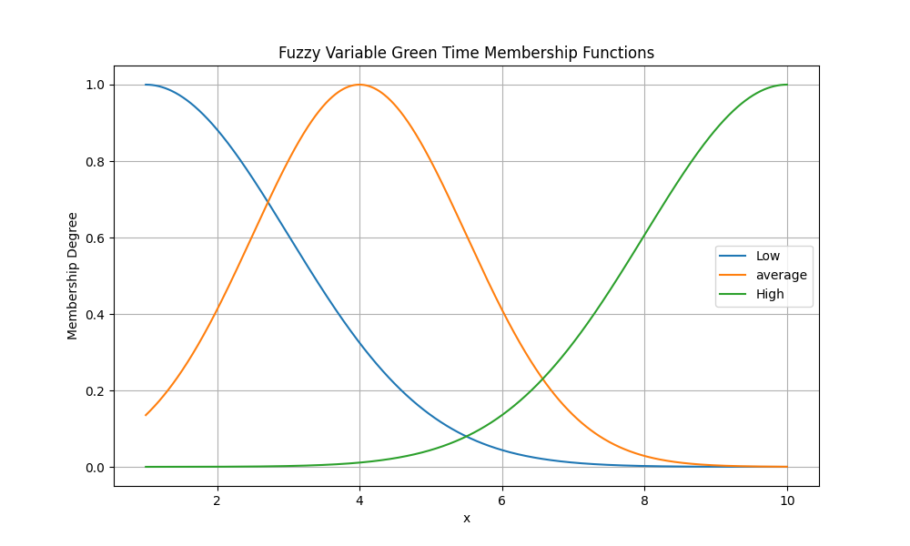
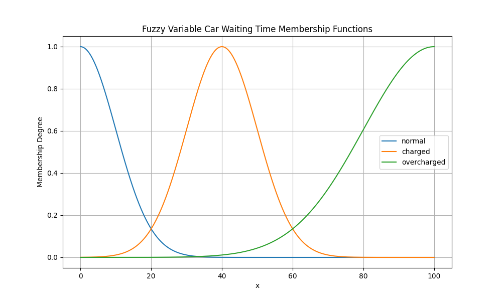

### Semáforos

Los semáforos poseen un sistema de lógica difusa en su comportamiento, alternan entre *ROJO*, permitiendo el paso de los peatones, y *VERDE* permitiendo el paso de los carros, que tanto tiempo debe permanecer un semáforo en *VERDE* y que tan cargado se encuentra son las preguntas que debe responder el sistema de lógica difusa. Con el objetivo de que si el factor peatonal es alto estaría menos tiempo en *VERDE* y viceversa. Aunque influyen más factores.

Las variables de entrada serían:
    - El clima, con conjuntos *lloviendo*, *nubloso*, *soleado*
    - El tiempo de espera de los carros (una vez se plantea cruzar un semáforo)
    - El tiempo de espera de los peatones (una vez se plantea cruzar un semáforo)
    - El mes del año.

Las variables de salida serían:
    - La sobre-carga del semáforo, usada por los carros.
    - El tiempo que ha de permanecer en verde.

Para cada variable de salida, para conjunto que de esta es necesario añadir una regla para determinar su valor : 

Algunas reglas que añadimos son:
    - el *GREEN_TIME* es alto si el mes es de alta o el tiempo de espera de los carros es alto o el tiempo de espera de los peatones es normal o el clima no es soleado o es de madrugada.
    - el *GREEN_TIME* es bajo si se cumple que el tiempo de espera de los carros es bajo y el tiempo de espera de los peatones es bajo y el tiempo no es lluvioso y además es de noche
    - el *OVERLOAD* es alto si el tiempo de espera de los peatones y los carros es alto.

#### Comportamiento

Siempre actualiza los valores de las variables de entrada.

Los tiempos de espera de los carros y los peatones son dados por estos cuando pasan el semáforo en cuestión.

Con alguna probabilidad (para evitar que esté constantemente ejecutando el proceso de inferencia) actualiza sus variables de salida ( ejecuta el proceso de inferencia).

Cada vez que cambia el *GREEN_TIME*, a consecuencia de cambios en las variables de entrada, espera a estar en estado *ROJO* y cambia el tiempo a verde.

Provee de un método público a los demás agentes para que estos sepan cuanto tiempo le queda a el semáforo en el estado en que se encuentra.