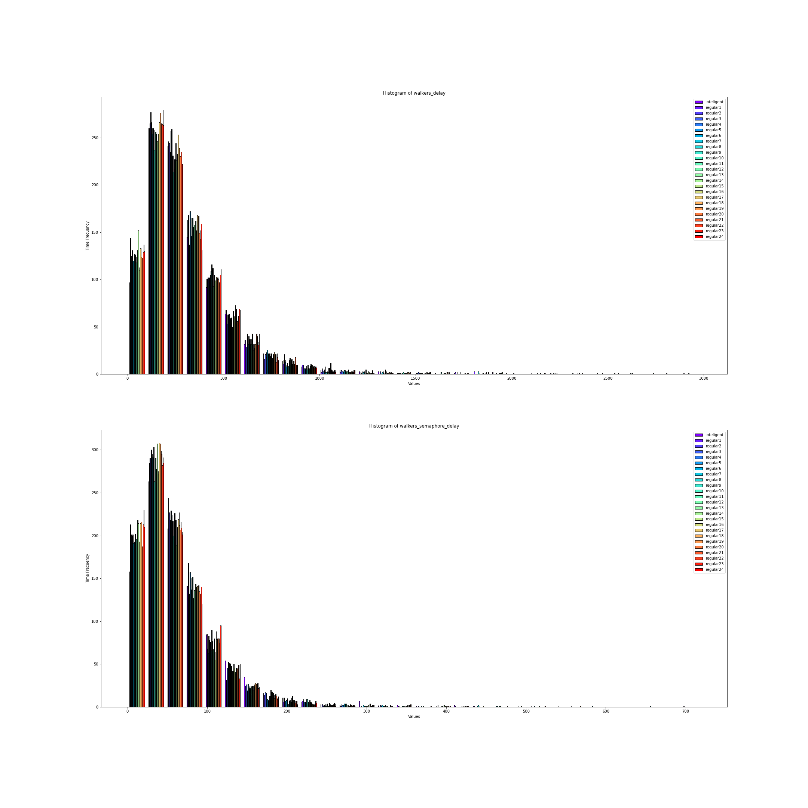

# Estadisticas

### General
Simulamos 24 veces con semáforos inteligentes y con semáforos normales con ello construimos un csv por cada simulacion. El objetivo principal es ver si con un semáforos inteligente los carros llegan mas rapido a su destino y si se demoran menos en los semáforos igualmente para los peatones.

#### Distribuciones
Vamos a graficar cada simulacion para ver que distribucion siguen. Para ello usamos histogramas y lo que haremos sera cojer una simulacion de los semáforos inteligente y compararlas con los semáforos normales todo en un mismo grafico.

Y la referente a los datos de los peatones

Obtuvimos que no siguen distribuciones normales ni ninguna otra conocida tambien pareciera que los semáforos inteligentes en general dan mejores resultados, pero esto proximamente lo comprobaremos mejor.

### Matriz de correlacion
Analizemos para una misma simulacion las matrices de correlacion entre los datos de cada csv que formamos.
Obtenemos que su correlacion es de 1 y tambien los graficamos usando un scatter plot y vemos que siguen una dependencia lineal.

### Test wilcoxon
Vamos a realizar un test wilcoxon para comprobar si hay diferencia significativa entre los datos de las simulaciones de semáforos inteligentes y normales.
Como podemos ver en la grafica los p_value son mayores que 0.05 entonces no podemos llegar a ninguna conclusion

### Comparar Medias
Por ultimo compararemos las medias de cada conjunto de simulaciones de semáforos inteligentes y no inteligentes.

Parece indicar que los semáforos no inteligentes minimizan mejor el tiempo de espera de los carros y peatones.

### Conclusiones