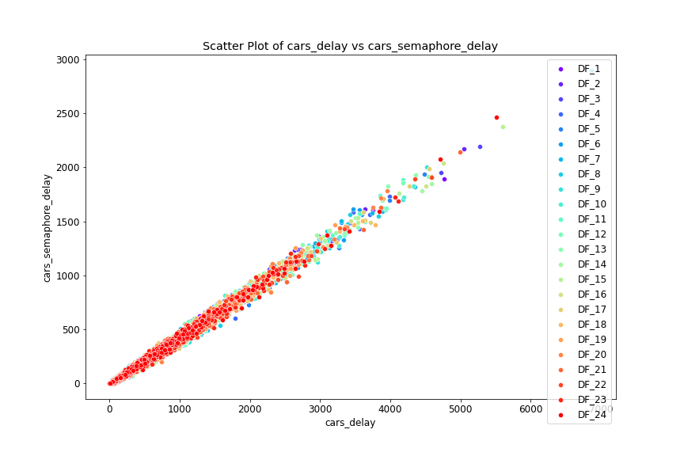

# Estadísticas

### General
Para analizar el problema planteado en este trabajo se realizó un análisis comparativo en cuanto a las operaciones de ambos tipos de semáforos (ya fueren inteligentes o estandar). Se llegó a ejecutar un promedio de 24 simulaciones en cada caso, permitiendo construir un dataframe de la biblioteca de Python Pandas para cada uno de los casos simulados, separando la información de cada simulación en los aspectos a analizar: peatones y vehículos. Con este trabajo nos plantearon como objetivo principal poder llegar a conocer la efectividad de los semáforos inteligentes en la actualidad, si con la implementación de estos los automóviles tienen realmente un recorrido más rápido hacia su destino y si disminuye el tiempo de los peatones en cada paso peatonal donde estos están.

#### Distribuciones
Implementando el uso de histogramas se graficaron cada una de las simulaciones realizadas para poder analizar la distribución de cada una de ellas. En el mismo gráfico estarán representadas ambas simulaciones simultáneamente (de semáforos tanto inteligentes como estandar).

A continuación los histogramas que representan el tiempo ocupado por los vehículos en semáforos inteligentes y estandar:

En este segundo grupo de gráficos los histogramas representan el tiempo que ocupan los peatones en semáforos inteligentes y estandar:

Los resultados obtenidos arrojaron que los histogramas no siguen distribuciones normales ni ninguna otra conocida. Con esto podríamos suponer que los semáforos en general brindan mejores resultados, pero esto podrá ser analizado a profundidad y comprobado a continuación.

### ScatterPlot
A continuación se realizará una representación usando el gráfico scatterplot de la biblioteca seaborn donde se analizarán valores que representan el tiempo total de tanto autos como peatones en un trayecto completo y qué tiempo de este es utilizado en la espera de los semáforos analizando cómo se comportan estas variables una con respecto a la otra. Verificándose representadas en cada caso:

En semáforos inteligentes;

En semáforos estandar;

Al observar los datos se puede inferir que existe una importante relación entre los datos, lo que nos indica que entre ellos cabe la existencia de una fuerte correlación; para lo cual se estarán realizando más pruebas.

### Matriz de correlación
Analizaremos para una misma simulación las matrices de correlación entre los datos de cada csv que formamos, toda esta información es analizada en los gráficos de scatterplot anteriores.
Como resultado se obtuvo que su correlación es de 1 lo que nos indica que dichos datos siguen una dependencia lineal.

### Test Wilcoxon signed-rank
Para comprobar la existencia o no de una diferencia significativa entre los datos analizados en las simulaciones de semáforos inteligentes y estandar se utilizó el Test Wilcoxon signed-rank.
Como podemos observar en la gráfica; los p_value son mayores que 0.05 por lo que no es posible llegar a ninguna conclusión.

### Comparar medias
Por último se compararán las medias de cada conjunto de simulaciones de semáforos inteligentes y no inteligentes.

Todo esto parece indicar que los semáforos estandar optimizan el tiempo de espera de los carros y peatones.

### Conclusiones