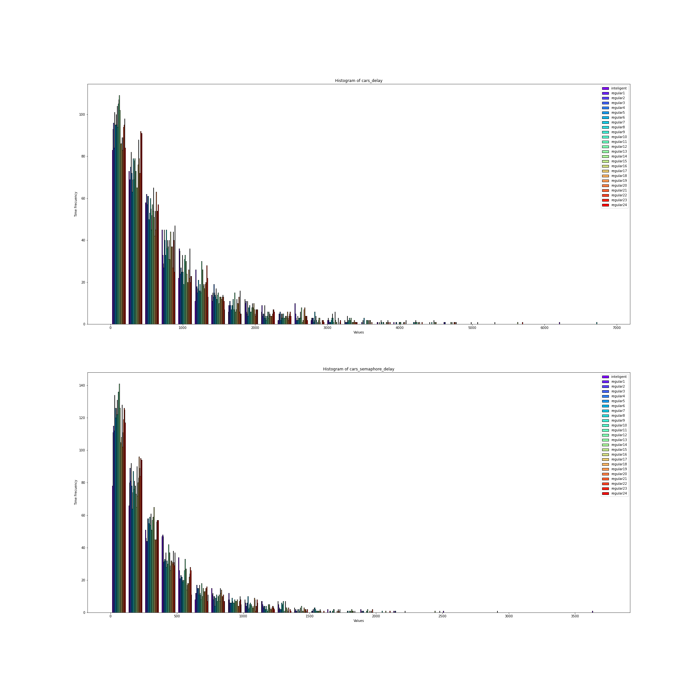
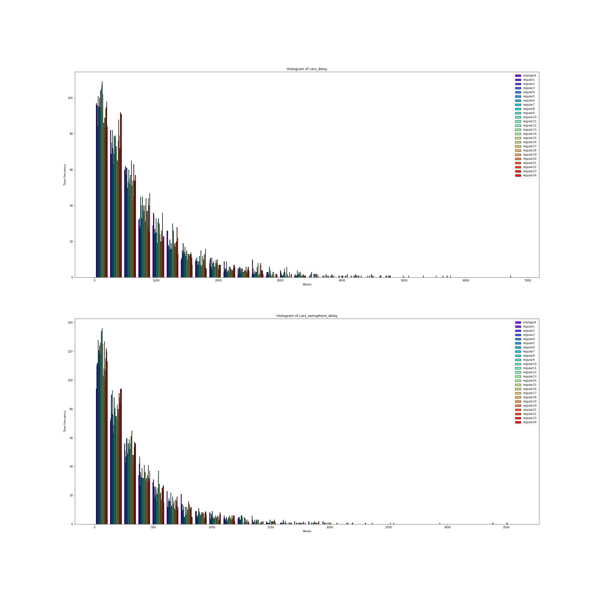
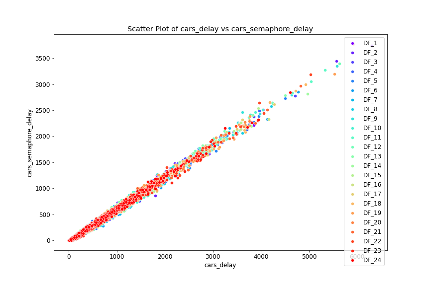

# Estadisticas

### General
Para analizar el problema planteado en este trabajo se realizo un analisis comparativo en cuanto las operaciones de ambos tipos de semaforos (ya fueran inteligentes o estandar) llegando a ejecutar un promedio de 24 simulaciones en cada caso y permitiendonos esta informacion construir un data frame de la biblioteca de Python Pandas para cada uno de los casos simulados, separando la informacion de cada simulacion en los aspectos a analizar:peatones y vehiculos. Con este trabajo nos planteamos como objetivo principal poder llegar a conocer la efectividad de los semaforos inteligentes en la actualidad, si con la implementacion de estos los automoviles tienen realmente un recorrido mas rapido hacia su destino y si disminuye el tiempo de los peatones en cada paso peatonal donde estos estan.

#### Distribuciones
Implementando el uso de histogramas graficamos cada una de las simulaciones realizadas para poder analizar la distribucion de cada una de ellas.En el mismo grafico estaran representadas ambas simulaciones simultaneamente (de semaforos tanto inteligentes como estandar).

A continuacion los histogramas que representan el tiempo ocupado por los carros en semaforos inteligentes y estandar:

En este segundo grupo de graficos los histogramas representan el tiempo que ocupan los peatones en semaforos inteligentes y estandar:

Los resultados obtenidos arrojaron que los histogramas no siguen distribuciones normales ni ninguna otra conocida.Con esto pudieramos suponer que los semaforos en general brindan mejores resultados,pero esto podrá ser analizado a profundidad y comprabar a continuación.

### ScatterPlot
A continuacion realizaremos una representacion usando el grafico scatterplot de la biblioteca seaborn donde analizaremos valores que representan el tiempo total de tanto autos como peatones en un trayecto completo y que tiempo de este es utilizado en la espera de los semaforos analizando como se comportan estas variables una con respecto a la otra.Viendose representadas en cada caso :

En semaforos inteligentes;

En semaforos estandar;

Al observar los datos se puede inferir que existe una importante relacion entre los datos,lo que nos indica que entre ellos cabe la existencia de una fuerte correlacion ;para lo cual estaremos realizando mas pruebas.

### Matriz de correlacion
Analizemos para una misma simulacion las matrices de correlacion entre los datos de cada csv que formamos,toda esta informacion es analizada en los graficos de scatterplot anteriores.
Como resultado se obtuvo que su correlacion es de 1 lo que nos indica que dichos datos siguen una dependencia lineal.

### Test Wilcoxon signed-rank
Para comprobar la existencia o no de una diferencia significativa entre los datos analizados en las simulaciones de semaforos inteligentes y estandar fue utilizado el Test Wilcoxon signed-rank.
Como podemos observar en la grafica; los p_value son mayores que 0.05 por lo que no nos es posible llegar a ninguna conclusion.

### Comparar Medias
Por ultimo compararemos las medias de cada conjunto de simulaciones de semáforos inteligentes y no inteligentes.

Todo esto parece indicar que los semáforos estandar optimizan el tiempo de espera de los carros y peatones.

### Conclusiones
